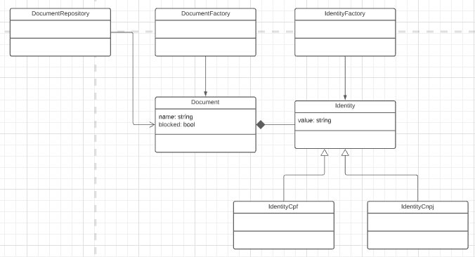

# CPF/CNPJ Crud Application using Go and Vue.js 3

A small application with backend and frontend to manage documents and blocked list.

Was developed a page list with paginated table, allowing sort and filters. Also a form to edit and insert documents.

The page list allow multiselection to block/unblock more than one documents per time.

## Frameworks and stacks

- Database: Mongodb
- Backend: Golang, Echo, Swaggo and Mongo-driver
- Frontend: Vue.js 3, Typescript, PrimeVue 3 (at moment, the only one framework with some useful ui components to support Vue.js 3)

## Simple domain diagram



## Endpoints and hosts:

- APP: http://localhost/
- Swagger: http://localhost:8080/swagger/index.html
- Mongo client: http://localhost:8081/db/cpfcnpj/
- API: http://localhost:8080

APIs backend:

| Url                                    | Method | ParamByUrl                                                                                                           | ParamByBody                    | Description                                                          |
| -------------------------------------- | ------ | -------------------------------------------------------------------------------------------------------------------- | ------------------------------ | -------------------------------------------------------------------- |
| http://localhost:8080/stats            | GET    |                                                                                                                      |                                | Return server up time, requisitions count and status response count. |
| http://localhost:8080/api/documents    | GET    | Example: ?page=0&resultsPerPage=10&sorts=[{"name":"name","order":"desc"}]&filters=[{"name":"name", "value":"Maria"}] |                                | Query all documents by a query param pattern                         |
| http://localhost:8080/api/documents    | POST   |                                                                                                                      | {name: "", identityNumber: ""} | Create a document                                                    |
| http://localhost:8080/api/documents/id | PUT    |                                                                                                                      | {name: "", identityNumber: ""} | Update the document                                                  |
| http://localhost:8080/api/documents/id | DELETE |                                                                                                                      |                                | Delete the document                                                  |
| http://localhost:8080/api/documents/id | GET    |                                                                                                                      | Get the document               |
| http://localhost:8080/api/blocklist    | PUT    |                                                                                                                      | uuids: ["",""]                 | Block the documents that have those uuids                            |
| http://localhost:8080/api/unblocklist  | PUT    |                                                                                                                      | uuids: ["",""]                 | Unblock the documents that have those uuids                          |

Possible responses from api methods:

| Method | Code               | Object                        |
| ------ | ------------------ | ----------------------------- |
| GET    | 200                | Document or PaginatedResponse |
| POST   | 201, 400, 404, 500 | null or Messages              |
| PUT    | 204, 400, 404, 500 | null or Messages              |
| DELETE | 204, 400, 404, 500 | null or Messages              |

| Object   | Fields                                                                                                  |
| -------- | ------------------------------------------------------------------------------------------------------- |
| Document | uuid: string; name: string; identityNumber: string; identityType: string;                               |
| Response | page: number; resultsPerPage: number; totalResults: number; content: Document[]; validations: Messages; |
| Messages | [validationType: string; description: string;]                                                          |

## How to run

```
docker-compose up
```

## How to update swagger docs

```
go get github.com/swaggo/swag/cmd/swag
swag init
```

## To finish/To fix

I tried run golang inside docker container with live reloading and debugger enabled together, but i've choice only one or other to work. (See docker-compose.yml commands)
